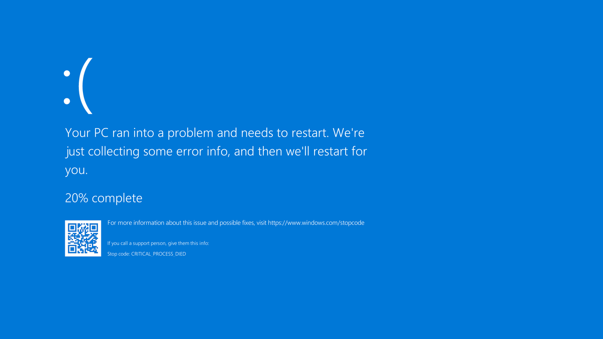

# Screen Of Death
Author of code and Research
  -  [M. Safdar Khan (Software Engineer)](https://twitter.com/theSafdarKhan)

This is a secource File that broing any Windows PC uptop Windows 10 latest Update 2021 to a Screen of Death Mode
If you are a windows user and you say this is a joke to just visting a link will fall your computer into trubleshoot mode with a screen of Death then click below link at your own risk.

## Is this really harmfull?
Yes it might be butg with some addition resources with this pached Link can even crack your Harddrive, Folder and so on. Here is what same link access with additional resource could do with your computer. https://www.bleepingcomputer.com/news/security/windows-10-bug-corrupts-your-hard-drive-on-seeing-this-files-icon/
My provided link will just put your computer into researt mode with a Screen of Death lke below

 
